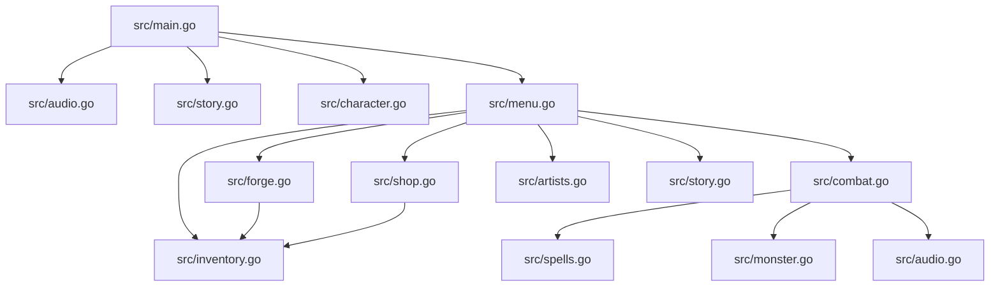
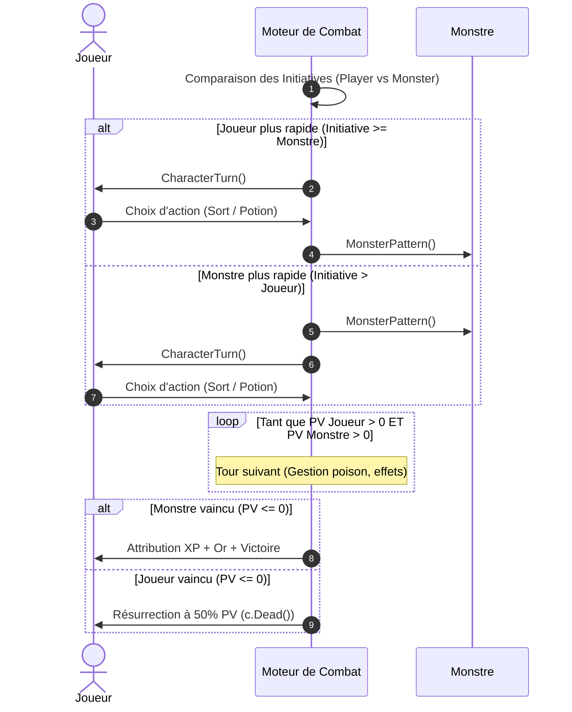
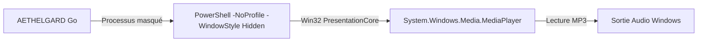

# 🏛️ Architecture & Conception Technique — AETHELGARD

Ce document décrit l'architecture logicielle, les structures de données, le cycle de vie du jeu et les choix techniques du projet **AETHELGARD**.

---

## 📐 Vue d'Ensemble & Modularité

Le projet est écrit en **Go (Golang)** et conçu selon une approche modulaire dans le package `main`. Chaque domaine fonctionnel est isolé dans un fichier dédié afin de garantir une séparation claire des responsabilités :



---

## 🧩 Structures de Données Principales

### 1. Personnage (`src/character.go`)
La structure `Character` encapsule l'intégralité de l'état du joueur :
```go
type Character struct {
    Name         string       // Nom formaté du joueur (1ère lettre majuscule)
    Class        string       // Humain, Elfe ou Nain
    Level        int          // Niveau actuel (démarre à 1)
    MaxHP        int          // Points de vie maximum
    CurrentHP    int          // Points de vie actuels
    Inventory    []string     // Liste des objets portés
    Skill        []string     // Sorts débloqués (ex: "Coup de poing", "Boule de Feu")
    MaxInventory int          // Capacité maximale du sac (10 par défaut, jusqu'à 40)
    Money        int          // Bourse en pièces d'or ($)
    Initiative   int          // Vitesse d'action en combat
    MaxMana      int          // Mana maximum (100)
    CurrentMana  int          // Mana restant
    CurrentXP    int          // Expérience accumulée
    MaxXP        int          // Seuil d'expérience pour monter de niveau (100)
    Equipment    Equipment    // Équipement actif (Tête, Corps, Pieds)
}

type Equipment struct {
    Head string // Chapeau / Capuche
    Body string // Tunique / Armure
    Feet string // Bottes
}
```

### 2. Monstres & Boss (`src/monster.go`)
```go
type Monster struct {
    Name       string // Nom de l'entité
    LifeMax    int    // PV Max
    Life       int    // PV Actuels
    Attack     int    // Puissance d'attaque physique
    Initiative int    // Valeur d'initiative (détermine qui commence)
    XPValue    int    // Gain d'XP pour le joueur en cas de victoire
    MoneyValue int    // Gain d'or pour le joueur en cas de victoire
    IsBoss     bool   // Déclenche la mise en scène et musique de Boss
}
```

---

## 🥊 Moteur de Combat Générique (`src/combat.go`)

Le moteur de combat repose sur une fonction unique et réutilisable : `ExecuteCombat(m *Monster)`.

### Cycle d'un affrontement :



### Règles du combat :
1. **Initiative** : Si l'initiative du joueur est supérieure ou égale à celle de l'adversaire, le joueur attaque en premier. Sinon, le monstre frappe en début de chaque round.
2. **Action du joueur (`CharacterTurn`)** :
   - *Sorts* : Déduction du coût en Mana -> Dégâts appliqués au monstre. Si Mana insuffisant, `continue` (le joueur ne perd pas son tour).
   - *Objets* : Consommation de potion de soin ou mana depuis l'inventaire -> Fin du tour (`return`).
3. **Pattern du Boss (`MonsterPattern`)** :
   - Tours normaux : Attaque physique de base.
   - Tour 3 (Cycle périodique) : Coup spécial dévastateur (*Frappe Sombre Lunaire* infligeant 200% de dégâts).

---

## 🔊 Architecture du Module Audio (`src/audio.go`)

Le module audio est conçu pour offrir une immersion Dark Fantasy tout en restant **léger, indépendant et sans dépendances CGO**.



### Principes clés :
1. **Processus asynchrones détachés** : Chaque piste est lancée dans un sous-processus PowerShell en arrière-plan via `exec.Command(...)`, sans bloquer la boucle principale du jeu.
2. **Résolution dynamique des chemins (`findAudioFile`)** : Le jeu détecte automatiquement le dossier `voix/` :
   - À côté du binaire compilé (`os.Executable()`).
   - Dans le répertoire courant (`./voix`).
   - En fallback de développement (`../voix`).
3. **Gestion propre du cycle de vie** :
   - Les commandes audio sont conservées sous forme de `*exec.Cmd`.
   - La fonction `StopAudioProcess(cmd *exec.Cmd)` tue proprement le processus Windows (`cmd.Process.Kill()`) lors des transitions de scènes ou à la fermeture du jeu (`defer StopAudioProcess(...)`).

---

## ⌨️ Gestion des Entrées Utilisateur & Sycalls

Dans `src/story.go`, la fonction `waitUser()` permet d'attendre la frappe d'une seule touche sans forcer l'utilisateur à appuyer sur [Entrée] :

```go
var procGetch = syscall.NewLazyDLL("msvcrt.dll").NewProc("_getch")

func waitUser() {
    fmt.Print("\n[ Appuyez sur une touche pour continuer... ]")
    procGetch.Call()
    fmt.Println()
}
```

* **Bibliothèque** : `msvcrt.dll` (*Microsoft Visual C Runtime* intégré à Windows).
* **Fonction C** : `_getch` capte directement le caractère clavier dans le buffer bas niveau de la console.
