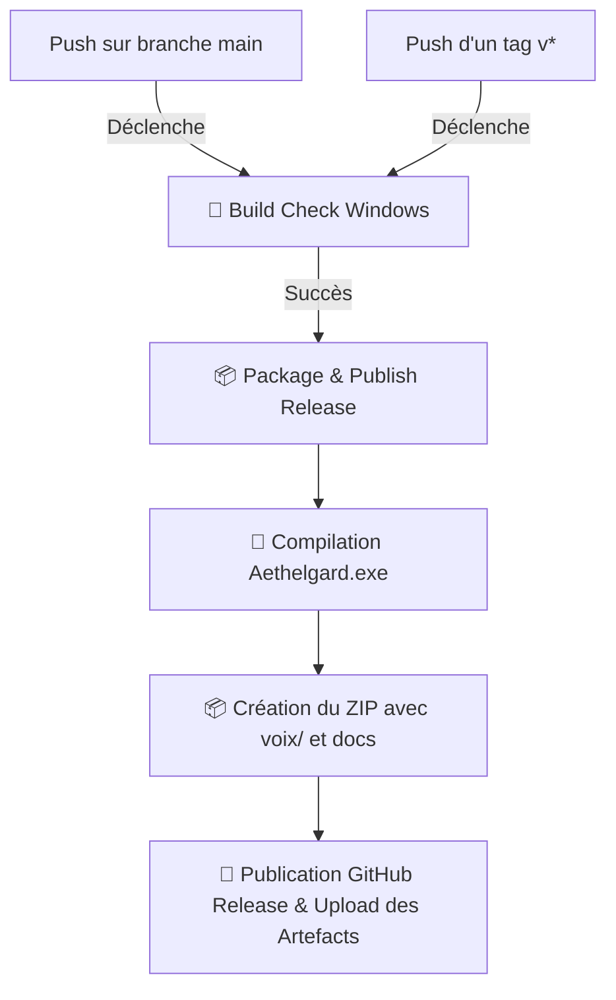

# 🛠️ Guide Développeur & CI/CD — AETHELGARD

Ce guide est destiné aux développeurs et contributeurs souhaitant travailler sur le code source d'**AETHELGARD**, étendre ses fonctionnalités ou comprendre le pipeline d'intégration continue (CI/CD).

---

## 💻 1. Prérequis & Environnement Local

* **Langage** : [Go (Golang)](https://go.dev/dl/) en version **1.20 ou supérieure** (1.22+ recommandée).
* **OS de Référence** : Windows 10/11 (pour la prise en charge complète du module audio natif et du syscall `_getch`).
* **Outils recommandés** : VS Code avec l'extension Go officielle, Git, PowerShell.

---

## ⚡ 2. Commandes Utiles

### Cloner le dépôt :
```bash
git clone https://github.com/Banane480/AETHELGARD.git
cd AETHELGARD
```

### Lancer le jeu directement depuis les sources :
```bash
# Depuis la racine du projet
go run ./src
```

### Compiler un binaire optimisé pour Windows :
```bash
# Compilation avec strip des symboles de débogage (-s -w pour un binaire plus léger)
go build -ldflags="-s -w" -o Aethelgard.exe ./src
```

---

## 🚀 3. Pipeline CI/CD GitHub Actions

Le workflow est défini dans [`.github/workflows/release.yml`](../.github/workflows/release.yml).

### Fonctionnement du Pipeline :



### 🏷️ Créer et Publier une Nouvelle Version

Pour déclencher automatiquement la compilation et la création d'une nouvelle release sur GitHub :

```bash
# 1. Vérifiez que votre branche main est propre
git status

# 2. Créez un tag annoté de version (ex: v2.1.0)
git tag -a v2.1.0 -m "Release v2.1.0 - Nouvelles fonctionnalités"

# 3. Poussez le tag sur GitHub
git push origin v2.1.0
```

GitHub Actions prend immédiatement le relais, compile le projet et met à disposition l'archive `.zip` et les binaires `.exe` dans l'onglet **Releases** de votre dépôt.

---

## 🧩 4. Guide d'Extension du Code

### ➕ Ajouter un nouveau Monstre
Dans [`src/monster.go`](../src/monster.go), créez une nouvelle fonction constructeur :
```go
func InitShadowDragon() Monster {
    return Monster{
        Name:       "Dragon des Ombres",
        LifeMax:    250,
        Life:       250,
        Attack:     25,
        Initiative: 14,
        XPValue:    300,
        MoneyValue: 200,
        IsBoss:     true,
    }
}
```
Puis ajoutez la zone dans le menu des donjons dans [`src/combat.go`](../src/combat.go).

---

### ➕ Ajouter un nouveau Sort
1. Dans [`src/spells.go`](../src/spells.go), ajoutez votre sort dans le `switch` de `CastSpell` :
```go
case "Éclair Sacré":
    damage = 35
    manaCost = 25
    if c.CurrentMana < manaCost {
        fmt.Println("❌ Pas assez de mana pour lancer l'Éclair Sacré !")
        return false
    }
    c.CurrentMana -= manaCost
    fmt.Printf("⚡ %s foudroie %s et inflige %d dégâts !\n", c.Name, m.Name, damage)
```
2. Ajoutez le livre de sort dans [`src/shop.go`](../src/shop.go) pour permettre au joueur de l'acheter.

---

### ➕ Ajouter une nouvelle Recette de Forge
Dans [`src/forge.go`](../src/forge.go), ajoutez l'option dans le menu et la vérification des matériaux :
```go
// Exemple pour un Bouclier en Fer
case 4:
    c.CraftItem("Bouclier de Fer", 15, map[string]int{
        "Minerai de Fer": 3,
        "Cuir de sanglier": 1,
    })
```

---

## 📐 5. Bonnes Pratiques & Conventions

* **Pointeurs de méthodes** : Toutes les méthodes modifiant l'état du joueur doivent utiliser un récepteur par pointeur `(c *Character)`.
* **Boucles d'interaction** : Pour les menus textuels, utilisez le pattern `for { ... fmt.Scan(&choice) ... switch ... }` avec un `case 0: return` pour quitter proprement.
* **Module Audio** : N'importez pas de packages CGO lourds. Laissez le module [`src/audio.go`](../src/audio.go) gérer l'audio via des sous-processus légers et indépendants.
